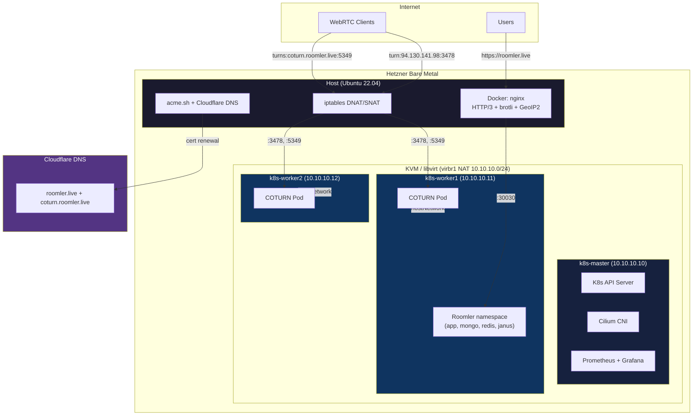

# K8s COTURN Cluster

Ansible-automated Kubernetes cluster on Hetzner bare metal for deploying a production-grade COTURN (TURN/STUN) server with TLS, monitoring, and zero-downtime certificate renewal.

## Features

| Category | Feature | Status |
|----------|---------|--------|
| Infrastructure | KVM/libvirt VMs on single Hetzner host | Done |
| Infrastructure | Cloud-init automated VM provisioning (Ubuntu 22.04) | Done |
| Infrastructure | NAT bridge networking (10.10.10.0/24) | Done |
| Kubernetes | K8s 1.29 with kubeadm | Done |
| Kubernetes | Cilium CNI (kube-proxy replacement, eBPF) | Done |
| Kubernetes | Helm v3 package management | Done |
| COTURN | Dual TURN/STUN instances on separate public IPs | Done |
| COTURN | TLS support (TURNS on port 5349 + 443 via SNI) | Done |
| COTURN | Long-term credentials (lt-cred-mech) | Done |
| COTURN | 1024 relay ports per instance (49152-50175) | Done |
| Networking | iptables DNAT/SNAT port forwarding | Done |
| Networking | ~~nginx SNI proxy~~ (removed, nginx2 no longer needed) | Removed |
| Networking | Docker restart hooks (iptables persistence) | Done |
| TLS | Let's Encrypt wildcard cert via acme.sh + Cloudflare DNS | Done |
| TLS | Auto-deploy hook (nginx, K8s secret, COTURN restart) | Done |
| DNS | Cloudflare DNS API helper scripts | Done |
| Monitoring | Prometheus + Grafana + AlertManager | Done |
| Monitoring | Custom COTURN Grafana dashboard | Done |
| Monitoring | Email alerts via SendGrid | Done |

## Tech Stack

| Layer | Technology |
|-------|------------|
| Host | Hetzner Bare Metal (Ubuntu 22.04) |
| Virtualization | KVM / libvirt / QEMU |
| VM Images | Ubuntu 22.04 Cloud (cloud-init) |
| Orchestration | Kubernetes 1.29 |
| CNI | Cilium 1.15.1 (eBPF, no kube-proxy) |
| TURN Server | [coturn](https://github.com/coturn/coturn) (instrumentisto/coturn) |
| Proxy | Docker nginx (HTTP/3, brotli, GeoIP2 — routes to K8s NodePorts) |
| TLS | Let's Encrypt (acme.sh, Cloudflare DNS-01) |
| DNS | Cloudflare (API-managed) |
| Monitoring | kube-prometheus-stack (Prometheus, Grafana, AlertManager) |
| Automation | Ansible 2.x |
| IaC | Makefile + Bash scripts |

## Architecture



### Network Flow

```
                        Internet
                           |
            +--------------+--------------+
            |              |              |
     :3478 (UDP/TCP)  :5349 (TCP)    :443 (HTTPS)
            |              |              |
    +-------+--------------+---+    +----+--------------------+
    |    iptables DNAT/SNAT    |    | Docker nginx            |
    | IP1 → worker1            |    | HTTP/3, brotli, GeoIP2  |
    | IP2 → worker2            |    | roomler.live → :30030   |
    +--------------------------+    | janus.* → :30808/:30818 |
               |                    +-------------------------+
    +----------+---------+                    |
    |                    |            +-------+--------+
    | k8s-worker1        |            | K8s NodePorts  |
    | COTURN + Roomler   |            | (10.10.10.11)  |
    | ext: 94.130.141.98 |            +----------------+
    | relay: 49152-50175 |
    +--------------------+
    | k8s-worker2        |
    | COTURN             |
    | ext: 94.130.141.74 |
    | relay: 49152-50175 |
    +--------------------+
```

## Prerequisites

- Hetzner dedicated server with 2 public IPs
- Ubuntu 22.04 on the host
- Ansible 2.x installed
- `sudo` NOPASSWD access
- Cloudflare account with API token (for DNS + cert renewal)

## Quick Start

```bash
# 1. Clone the repo
git clone git@github.com:gjovanov/k8s-cluster.git
cd k8s-cluster

# 2. Create .env with your secrets (see Environment Variables below)
cp .env.example .env
vi .env

# 3. Install Ansible collections
make collections

# 4. Run preflight checks
make preflight

# 5. Bootstrap everything (interactive, requires terminal + sudo)
make bootstrap

# 6. Verify the deployment
make verify
```

## Environment Variables

Create a `.env` file in the project root (never commit this file):

```bash
# Cloudflare API (for DNS management + Let's Encrypt DNS-01 challenge)
CF_Token=<your-cloudflare-api-token>
CF_Zone_ID=<your-cloudflare-zone-id>

# COTURN shared secret (for ephemeral credential generation)
COTURN_AUTH_SECRET=<your-random-hex-string>
```

| Variable | Description | Used By |
|----------|-------------|---------|
| `CF_Token` | Cloudflare API token (Edit zone DNS permission) | `cf-dns.sh`, `acme.sh` |
| `CF_Zone_ID` | Cloudflare Zone ID for `roomler.live` | `cf-dns.sh`, `acme.sh` |
| `COTURN_AUTH_SECRET` | HMAC-SHA1 shared secret for TURN ephemeral credentials | Ansible (COTURN ConfigMap) |

Generate a new COTURN secret:
```bash
openssl rand -hex 32
```

## Deployment Phases

The deployment is split into 10 idempotent phases, each runnable independently:

| Phase | Playbook | Target | Description |
|-------|----------|--------|-------------|
| 1 | `01-host-setup.yml` | localhost | Install KVM/libvirt, create NAT network |
| 2 | `02-vm-provision.yml` | localhost | Create 3 Ubuntu VMs with cloud-init |
| 3 | `03-k8s-common.yml` | all VMs | Install containerd, kubeadm, kubelet, Helm |
| 4 | `04-k8s-master.yml` | k8s-master | `kubeadm init`, install Cilium CNI |
| 5 | `05-k8s-workers.yml` | k8s-workers | `kubeadm join`, label nodes |
| 6 | `06-coturn-deploy.yml` | k8s-master | Deploy COTURN pods (namespace, TLS, ConfigMap) |
| 7 | `07-host-networking.yml` | localhost | iptables DNAT/SNAT port forwarding |
| 8 | `08-host-kubectl.yml` | localhost | Install kubectl on host, copy kubeconfig |
| 9 | `09-sni-proxy.yml` | localhost | nginx SNI proxy for TURNS on port 443 |
| 10 | `10-monitoring.yml` | k8s-master | Prometheus + Grafana + AlertManager |

```bash
# Run all phases
make setup

# Run individual phases
make phase1
make phase6 phase7

# Run a range via bootstrap
./bootstrap.sh 3 7    # phases 3 through 7
```

## VM Topology

| VM | IP | vCPUs | RAM | Disk | Role |
|----|-----|-------|-----|------|------|
| k8s-master | 10.10.10.10 | 2 | 4 GB | 40 GB | Control plane, monitoring |
| k8s-worker1 | 10.10.10.11 | 4 | 8 GB | 60 GB | COTURN (ext: 94.130.141.98) |
| k8s-worker2 | 10.10.10.12 | 4 | 8 GB | 60 GB | COTURN (ext: 94.130.141.74) |

## COTURN Configuration

Each COTURN instance runs as a K8s pod with `hostNetwork: true`, pinned to a specific worker node via `nodeSelector`.

| Setting | Value |
|---------|-------|
| Image | `instrumentisto/coturn:latest` |
| Realm | `roomler.live` |
| Listening port | 3478 (TCP + UDP) |
| TLS port | 5349 (TCP) |
| Alt TLS port | 443 (TCP, via SNI proxy) |
| Relay port range | 49152 - 50175 (1024 ports) |
| Auth method | `lt-cred-mech` (long-term credentials) |
| TLS cert | Let's Encrypt wildcard (`*.roomler.live`) |

### Long-Term Credentials

COTURN uses `lt-cred-mech` with a static username and HMAC key. Generate the key with:

```bash
# Inside COTURN pod
kubectl exec -n coturn <pod> -- turnadmin -k -u <username> -r roomler.live -p <password>
```

The generated key (e.g., `0x32c09cdc8033e01088f9b6b2f7450518`) is stored in the COTURN ConfigMap as `user=<username>:<key>`.

### Testing COTURN

Open `coturn_test.html` in a browser, paste your `COTURN_AUTH_SECRET`, and click **Test All URLs**. It tests all TURN/TURNS endpoints and reports relay candidate results.

## Scripts

| Script | Description |
|--------|-------------|
| `scripts/cf-dns.sh` | Cloudflare DNS API helper (list, add, update, delete records) |
| `scripts/cf-dns-setup.sh` | One-time DNS record population for domain migration |
| `scripts/acme-deploy-hook.sh` | Certificate renewal hook (deploys to nginx + K8s + COTURN) |
| `scripts/verify-cluster.sh` | Comprehensive health check (VMs, K8s, COTURN, iptables, ports) |
| `scripts/teardown.sh` | Full or partial cleanup (VMs, network, iptables) |

### DNS Management

```bash
# List all DNS records
./scripts/cf-dns.sh list

# Add a record (idempotent)
./scripts/cf-dns.sh add A coturn.roomler.live 94.130.141.98
./scripts/cf-dns.sh add MX roomler.live aspmx.l.google.com 1

# Update a record
./scripts/cf-dns.sh update <record-id> '{"proxied": false}'

# Delete a record
./scripts/cf-dns.sh delete <record-id>
```

## Makefile Reference

```bash
make help              # Show all targets
make preflight         # Check prerequisites
make collections       # Install Ansible collections
make bootstrap         # Full interactive bootstrap (all phases)
make setup             # Run all phases non-interactively
make phase<N>          # Run specific phase (1-10)
make verify            # Run health checks
make status            # Show cluster status
make teardown          # Full cleanup
make teardown-keep-vms # Cleanup networking only

make ssh-master        # SSH into k8s-master
make ssh-worker1       # SSH into k8s-worker1
make ssh-worker2       # SSH into k8s-worker2

make kubectl ARGS="get pods -n coturn"   # Run kubectl
make grafana-tunnel    # SSH tunnel to Grafana (localhost:3000)
```

## Monitoring

The monitoring stack is deployed via `kube-prometheus-stack` Helm chart:

| Component | Access |
|-----------|--------|
| Grafana | `make grafana-tunnel` then http://localhost:3000 |
| Prometheus | Port-forward to 9090 |
| AlertManager | Email alerts via SendGrid |

### Alerts

| Alert | Severity | Condition |
|-------|----------|-----------|
| COTURNPodDown | Critical | Pod replicas < 1 |
| COTURNPodRestarting | Warning | > 3 restarts/hour |
| COTURNHighMemory | Warning | > 85% memory limit |
| NodeHighCPU | Warning | > 85% CPU for 10m |
| NodeHighMemory | Critical | > 90% RAM for 5m |
| NodeDiskSpaceLow | Warning | > 85% disk used |

## TLS Certificate Renewal

Certificates are managed by `acme.sh` with Cloudflare DNS-01 challenge:

```bash
# Automatic (cron runs daily at 22:55)
sudo crontab -l | grep acme

# Manual force-renew
source .env && export CF_Token CF_Zone_ID
sudo -E /root/.acme.sh/acme.sh --renew \
  -d roomler.live -d '*.roomler.live' \
  --dns dns_cf --ecc --force
```

The deploy hook (`scripts/acme-deploy-hook.sh`) automatically:
1. Copies cert to Docker nginx volumes
2. Reloads Docker nginx + nginx2
3. Recreates K8s `coturn-tls` secret
4. Restarts COTURN pods

## Troubleshooting

| Problem | Solution |
|---------|----------|
| COTURN pods not starting | `make kubectl ARGS="describe pod -n coturn"`, check TLS secret exists |
| Relay tests fail | Verify iptables: `sudo iptables -t nat -L COTURN_DNAT -n -v` |
| Roomler SSR hangs | Stale iptables rule may intercept TCP 443. Check `iptables -t nat -L COTURN_DNAT -n` |
| iptables lost after reboot | Check systemd service: `sudo systemctl status coturn-iptables` |
| Cert renewal fails | Check acme.sh log: `sudo cat /root/.acme.sh/acme.sh.log` |
| Grafana not accessible | `make grafana-tunnel`, check NodePort 30300 |
| Workers not joining | Check join token TTL (2h), re-run `make phase5` |
| VM SSH fails | `make ssh-worker1`, check `virsh domstate k8s-worker1` |

## Project Structure

```
k8s-cluster/
├── .env                          # Secrets (gitignored)
├── .gitignore
├── Makefile                      # CLI targets for all operations
├── bootstrap.sh                  # Interactive bootstrap script
├── ansible.cfg                   # Ansible configuration
├── coturn_test.html              # TURN connectivity test (browser)
│
├── inventory/
│   ├── hosts.yml                 # Host inventory (master + 2 workers)
│   └── group_vars/
│       └── all.yml               # All Ansible variables
│
├── playbooks/
│   ├── site.yml                  # Master playbook (all phases)
│   ├── 01-host-setup.yml         # KVM/libvirt setup
│   ├── 02-vm-provision.yml       # VM creation (cloud-init)
│   ├── 03-k8s-common.yml        # K8s prerequisites
│   ├── 04-k8s-master.yml        # Control plane bootstrap
│   ├── 05-k8s-workers.yml       # Worker join + labels
│   ├── 06-coturn-deploy.yml     # COTURN deployment
│   ├── 07-host-networking.yml   # iptables DNAT/SNAT
│   ├── 08-host-kubectl.yml      # Host kubectl setup
│   ├── 09-sni-proxy.yml         # nginx SNI proxy
│   └── 10-monitoring.yml        # Prometheus + Grafana
│
├── roles/
│   ├── host-setup/               # KVM/libvirt installation
│   ├── vm-provision/             # VM provisioning (cloud-init)
│   ├── k8s-common/               # K8s prerequisites (containerd, kubeadm)
│   ├── k8s-master/               # Control plane (kubeadm init, Cilium)
│   ├── k8s-worker/               # Worker join + labeling
│   ├── coturn/                   # COTURN K8s deployment
│   ├── host-networking/          # iptables port forwarding
│   ├── sni-proxy/                # nginx SNI multiplexer
│   └── monitoring/               # kube-prometheus-stack
│
└── scripts/
    ├── cf-dns.sh                 # Cloudflare DNS API helper
    ├── cf-dns-setup.sh           # DNS migration setup
    ├── acme-deploy-hook.sh       # Cert renewal deploy hook
    ├── verify-cluster.sh         # Health check script
    └── teardown.sh               # Cleanup script
```

## License

MIT
